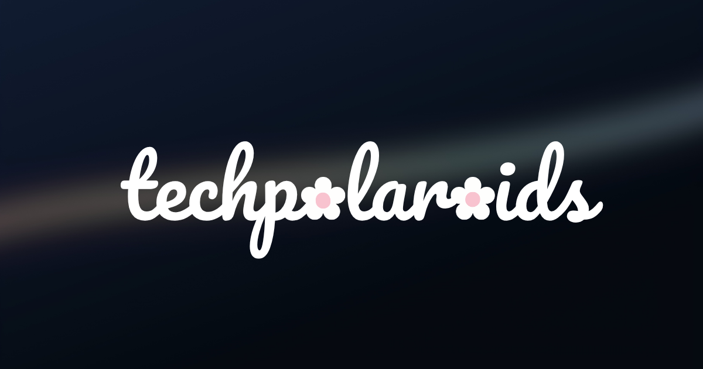

# ✿ TechPolaroids

### a tech diary from before the code

> A diary somewhere between a devlog and a shoebox, where unfinished ideas, strange project names, rebuilds, mistakes, and beautiful technical detours get to stay.

[Visit TechPolaroids](https://techpolaroids.github.io/) · [View the living source](https://github.com/techpolaroids/techpolaroids.github.io)

## About the project

TechPolaroids is my personal editorial archive of building things in code.

Most portfolios preserve the finished interface and quietly discard everything that came before it. TechPolaroids keeps the crooked parts: the accidental sentence that became a universe, the childhood curiosity that became computer science, the model trained to understand cat energy, and the experiments still deciding what they want to become.

It is not a tutorial blog or a traditional project gallery. It is the narrative layer behind my work—part build diary, part field notebook, part collection of technological memories.

> A screenshot is proof. A polaroid is a memory. I kept the crooked ones; the creases stay.

## What lives inside

- **Latest Exposure** — the newest long-form story from behind a project
- **Currently Developing** — an honest view of what is being built now
- **Archive** — name origins, prologues, build diaries, mistakes, and useful realizations
- **Proof of Practice** — small constraints that turn curiosity into consistent work
- **365 Days of Code** — one honest artifact, lesson, or commit at a time, beginning January 1, 2027
- **Summerlore** — seasonal inserts for the softer parts of creating
- **Random Entry** — a detour into something unexpected

## Selected exposures

### How “shimmer… where?” became an entire universe

The accidental sentence behind Shimmerwhere, and why a project name can become a place to live.

### The kid who took everything apart

Broken toy cars, old gadgets, PSPs, and the long route from curiosity to computer science.

### Teaching a tiny machine to read cat energy

PurrSona, five feline archetypes, one gradient-boosting model, and an ONNX escape plan.

## The interface

TechPolaroids is designed like the opening title of an indie technology documentary:

- A rain-soaked blue-black dark theme
- A pearl-toned light theme
- A blurred pastel streak crossing the atmosphere
- A custom Pac-Man-and-flowers wordmark
- Frosted editorial cards and polaroid imagery
- Interactive Day Zero and Summerlore cubes
- Golden-hour cursor light
- Responsive navigation and mobile layouts
- Motion that softens or disappears when reduced motion is preferred

Dark mode feels like coding after midnight. Light mode feels like opening the curtains after finishing.

## Built with

- Semantic HTML
- Modern CSS
- Vanilla JavaScript
- Canvas-based rain
- CSS 3D transforms
- GitHub Pages

No framework was needed. The site remains a small, hand-built static publication.

## Accessibility and interaction

The interface includes:

- Keyboard-visible focus states
- Semantic navigation and section structure
- An ARIA-labelled theme switch
- Responsive layouts down to phone widths
- Reduced-motion handling
- Descriptive image text
- Touch-friendly controls
- Light and dark contrast systems

Accessibility is treated as part of the atmosphere, not something added after the design is finished.

## Repository note

This personal repository preserves the project case study and development story.

The live website is maintained by the independent [TechPolaroids organization](https://github.com/techpolaroids) in [`techpolaroids.github.io`](https://github.com/techpolaroids/techpolaroids.github.io). That repository is the canonical source for the deployed site.
